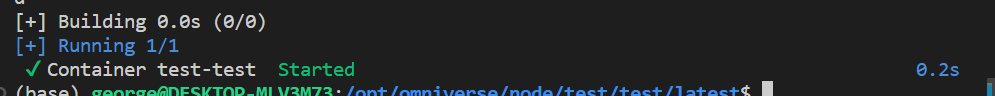

# Auto-Deployment

From this tutorial, you can learn how to deploy an Omniverse token and launch the synchronizer.

- [Prerequisites](#prerequisites)
- [Launch local chains with Docker](#install-and-start-the-parachains-and-evm-chain-locally-for-o-dlt-token)
- [Deploy `O-DLT` tokens](#auto-deploy-o-dlt-token-and-initialization)

  - [Installation](#install)
  
  - [Configure omniverse token](#configure)

  - [Deployment and initialization](#auto-deployment-and-initializations)

- [Launch synchronizers](#launch-the-auto-synchronizer)

  - [Configure synchronizers](#configure-1)

  - [Launch synchronizers with Docker](#launch-the-auto-synchronizer)

- [Note](#noteoption)

  - [Specification of system test tool configurations](#tool-config)

  - [Launch more synchronizers](#launch-more-auto-synchronizers)

  - [Create more omniverse tokens](#create-more-omniverse-tokens)

  - [Deploy on public EVM chains](#deploy-on-public-evm-chains)

## Prerequisites

- Ubuntu 20.04
- docker and docker-compose
- node >= v18.12
- npm >= 8.19

## Install and start the Parachains and EVM chain locally for `O-DLT` token

We have made Docker images for these nodes, so you can launch nodes easily
```
wget https://omniversedlt.s3.amazonaws.com/docker-compose.yaml
docker-compose up -d
```

The output is like this


The following chains will be installed and launched locally with rpc addresses:
- Ink! Parachain: ws://127.0.0.1:10102
- Swap Parachain: ws://127.0.0.1:10101
- Local EVM chain: http://127.0.0.1:10100

## Auto-deploy `O-DLT` token and initialization

We use the [system test tool](https://github.com/Omniverse-Web3-Labs/omniverse-system-test/tree/milestone-2) which is shown in [Test guide](https://github.com/Omniverse-Web3-Labs/Omniverse-DLT-Introduction/blob/main/docs/test-guide/m2-test-guide.md) to deploy contracts.

### Installation

#### Clone the repository

```sh
git clone -b milestone-2 --recursive https://github.com/Omniverse-Web3-Labs/omniverse-system-test.git
```

#### Install

Enter the working directory, and execute the following commands

```sh
npm install
```

#### Install for related projects

```sh
node src/index.js -i
```

### Configure

#### Replace config file

Enter the working directory, replace `omniverse-system-test/config/default.json` with `omniverse-system-test/config/deploy.template.json`
```
cd omniverse-system-test
cp config/deploy.template.json config/default.json
```

#### Change config(Optional)

For this demonstration, you do not need to change anything, you can refer [Tool config](#tool-config) for more details.

### Auto-deployment and initializations

```
node src/index.js -d token [-c <NUM>]
```
About `-c <NUM>`:
- The parameter is optional
- It indicates how many tokens you want to deploy
- If the parameter is absent, it is equivalent to `node src/index.js -d token -c 1`

This process is almost the same as [test guide](https://github.com/Omniverse-Web3-Labs/Omniverse-DLT-Introduction/blob/main/docs/test-guide/m2-test-guide.md#explaination-of-fungible-tokens-test), except that it will not run test cases.

If successful, you can see the outputs like this, input **^C** to stop


    
The following things will be done in the deployment process
- Deployment of the related (set in the `default.json`) Ink! omniverse token 
- Deployment of the related (set in the `default.json`) EVM omniverse token 
- Deployment of the related (set in the `default.json`) Pallet omniverse token
- Initilazation of omniverse tokens
    - Set members
    - Set cooling time
    - Set Decimal
- Transfer gas tokens to testing accounts

## Launch the auto-synchronizer

You can use the `omniverse-system-test/submodules/omniverse-synchronizer`

### Configure

The config file `omniverse-system-test/submodules/omniverse-synchronizer/config/default.json` and secret key file `omniverse-system-test//submodules/omniverse-synchronizer/config/.secret` will be created automatically when you running deployment command, you do not need to change it.

You can refer [Omniverse-synchronizer](https://github.com/Omniverse-Web3-Labs/omniverse-synchronizer/blob/milestone-2/README.md) for more information.

### Launch the synchronizer

#### Make a working directory

Make a directory as the working directory of the synchronizer, **you can use any directory as you like**
```
sudo mkdir -p /opt/omniverse/node/test/test/latest/
```

#### Download `docker-compose.yaml`

Download the `docker-compose.yaml` file into the synchronizer working directory
```
sudo wget https://omniversedlt.s3.amazonaws.com/synchronizer/docker-compose.yaml -O /opt/omniverse/node/test/test/latest/docker-compose.yaml
```

#### Prepare config files

Copy the config directory of the synchronizer project in `omniverse-system-test/submodules` into the synchronizer working directory
```
sudo cp -r ./submodules/omniverse-synchronizer/config /opt/omniverse/node/test/test/latest/
```

#### Launch

Execute the following command to launch the synchronizer.
```
cd /opt/omniverse/node/test/test/latest/
docker-compose up -d
```

You can see outputs like this



- View logs

```
sudo docker logs -f test-test
```

You can see outputs like this


- Stop the synchronizer

In the working directory, execute the following command

```
docker-compose down
```

## Note(Option) 

### Tool config

Open `omniverse-system-test/config/default.json`

- **tokenInfo**
`tokenInfo` is the token information of the omniverse tokens you will deploy, you can change it as you want.

```
"tokenInfo": {
        "token": [{
            "name": "SKYWALKER",
            "symbol": "SKYWALKER"
        }, {
            "name": "EARTHWALKER",
            "symbol": "EARTHWALKER"
        }]
    },
```

When deploying contracts, token names will be picked from the field `tokenInfo`. If the number of the contracts to be deployed is larger than the array size of `tokenInfo`, token name will derived from the last token name by adding a suffix, such as `SKYWALKER1`.

- **networks**
`networks` contains the chains on which you will deploy omniverse tokens

- rpc: `http` end point of a node connected to the network
- ws: `websocket` end point of a node connected to the network
- chainType: What kind of chain you will deploy omniverse token on, currently you can choose: EVM, INK, SUBSTRATE
- omniverseChainId: The omniverse chain id is set for all public chains, namely each chain will have a unique omniverse chain id. Currently, you can set any id the this field, just keep it unique in the configuration.
- coolingDown: Cooling down time, the interval between two omniverse transactions, just let what it is if you use local nodes.
- chainId: The field is the EVM chain id, so it is only used when the chain type is `EVM`.
- chainName: The chain name you assign to the chain.

### Launch more auto-synchronizers

If you want to start more auto-synchronizers, repeat the [Launch the auto-synchronizer](#launch-the-auto-synchronizer), but keep in mind that **you must use different working directories**.

### Create more omniverse tokens

If you want to create more omniverse tokens, repeat the [Auto-deploy `O-DLT` token and initillization](#auto-deploy-o-dlt-token-and-initillization) and [Launch the aotu-synchronizer](#launch-the-aotu-synchronizer)

### Deploy on public EVM chains

There are only four additional steps to deploy contracts on live EVM chains

1. Prepare two accounts with tokens
2. Add a field `accounts` in `omniverse-system-test/config/default.json`
```
"accounts": "./config/.secret"
```
3. Add a secret key file `.secret` in the directory `config`, and input private keys in the file
```
[
    "<OWNER_PRIVATE_KEY>",
    "<PORTER_PRIVATE_KEY>"
]
```
- The format of the private key is like this `0xb97de1848f97378ee439b37e776ffe11a2fff415b2f93dc240b2d16e9c18xxxx`
- `<OWNER_PRIVATE_KEY>` is used to deploy contracts
- `<PORTER_PRIVATE_KEY>` is used in the synchronizer to synchronize omniverse transactions

4. Change the field `networks` in `omniverse-system-test/config/default.json`

For example, to deploy on Ethereum
```
"networks": [
        {
            "rpc": "https://eth.llamarpc.com",
            "ws": "wss://eth.llamarpc.com",
            "chainId": 1,
            "chainType": "EVM",
            "coolingDown": 10,
            "chainName": "ETHEREUM"
        }
    ],
```