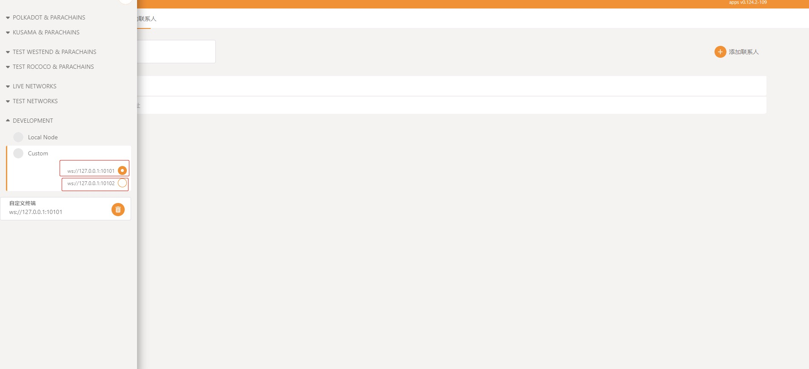

# Auto-Tutorial

This guide descripes how to make omniverse operations with the omniverse CLI tools, and the code in the CLI tool is a basis for developers to build their `O-DLT` dApps.  

The content includes:  
- [Prepare the operation tools](#operations-and-codes)
- [Prepare Operation Accounts](#prepare-operation-accounts)
- [Check Operation accounts](#check-operation-accounts)
- [Example of Making Omniverse Transactions](#make-omniverse-transactions)
- [Example of Making Omniverse Token Swap](#make-omniverse-token-swap)
- [Some convenience by `Polkadotjs`](#ink-contract-query-balance-in-the-explorer)

## Operations and Codes

Before commencing this tutorial, you should have generated a minimum of `O-DLT` token. To perform swap, you will need at least two `O-DLT` tokens. Now we have created two `O-DLT` tokens by [Auto-Deployment](./Auto-Deployment.md), the tokens id are `SKYWALKER` and `EARTHWALKER` respectively. After deployment, The following chains will be installed and launched locally with rpc addresses:

- Ink! Parachain: ws://127.0.0.1:10102

- Swap Parachain: ws://127.0.0.1:10101



Command-line tool:

We suppose you have cloned the [the tools repository `omniverse-system-test`](./Auto-Deployment.md#clone-the-tools-repository) and updated the submodules.  

```sh
cd omniverse-system-test/submodules/omniverse-swap-tools/omniverse-helper
```

### Prepare Operation Accounts

- If the deployment and operating is just locally, it is automatically generating `10` operation accounts during [deployment](./Auto-Deployment.md), the details of which could be found at [show all accounts](#show-all-accounts). **In this case you need to do nothing.**  
- In practice, we deploy smart contracts on public `Ink!` chains like `Astar` and on public EVM chains like `Ethereum`. You need to create your omniverse accounts and get some gas tokens from the related public faucets. We won't describe the details in this tutorial, and you can easily find related information on `google`.  

### Check Operation accounts

You can utilize the following command to display all the available accounts you can use. For the purpose of testing, a variety of accounts have been made available. `Account 0` is the owner of Omniverse token, `Account 1` serves as the synchronizer, `Account 2` is for swap operations, and while the remaining accounts are general users.

```sh
node index.js -a

##########################################################
Account 0
Private key 0x0cc0c2de7e8cxxxxxxxxxxsssxxxxxxxxxxxxxxxxxxxxx61055481df7014f7fa
Omniverse Account 0xb0c4ae6f28a5579cbeddbf40b2209a5296baf7a4dc818f909e801729ecb5e663dce22598685e985a6ed1a557cf2145deba5290418b3cc00680a90accc9b93522
Substrate address 5EoWfEE2T7SE3fXUg6hFFzXTJnexBVedXJWt588tfQWVtzsP
EVM address 0xe092b1fa25DF5786D151246E492Eed3d15EA4dAA
##########################################################
Account 1
Private key 0xb97de1848f97378xxxxxxxxxxsssxxxxxxxxxxxxxxxxxxxxx0b2d16e9c184ba9
Omniverse Account 0x99f5789b8b0d903a6e868c5fb9971eedde37da046e69d49c903a1b33167e0f76d1f1269628bfcff54e0581a0b019502394754e900dcbb69bf30010d51967d780
Substrate address 5HPUJrAvRtADLw6K6pfZB6yB1ZSDiNEh2RTFdNM4oA1PaVm4
EVM address 0xc0d8F541Ab8B71F20c10261818F2F401e8194049
##########################################################
...
```

### Make Omniverse Transactions

All operations are performed within the `omniverse-helper` directory. Sender private key in file `.secret`.

- Mint
  - [Source Code](https://github.com/Omniverse-Web3-Labs/omniverse-swap-tools/blob/main/omniverse-helper/index.js#L181)
  - CLI: `node index.js --mint CHAIN_NAME,TOKEN_ID,RECIPIENT,AMOUNT`.
  - Instruction: mint `AMOUNT` `TOKNE_ID` to `RECIPIENT`, the sender must be the owner of `TOKEN_ID`.
  - example: for this example, the owner of `SKYWALKER` is `Account 0` and mint to `Account 4`

    ```sh
    node index.js -s 0
    node index.js --mint CHAIN2,SKYWALKER,0x8bb25caae0a466afde04833610cf0c998050693974188853bdb982ed60e5e08ee71b3c9c0f900f8191512787e47908277272f71f991cb15fa364bad8018ef40b,100
    ```

- In the above example, the address is `account 4`. You can utilize the following command to switch the account that you want to use.

  ```sh
  node index.js -s 4
  ```

- Transfer
  - [Source Code](https://github.com/Omniverse-Web3-Labs/omniverse-swap-tools/blob/main/omniverse-helper/index.js#L164)
  - CLI: `node index.js --transfer CHAIN_NAME,TOKEN_ID,RECIPIENT,AMOUNT`.
  - Instruction: transfer `AMOUNT` `TOKNE_ID` to `RECIPIENT`.
  - example: for this example, then sender is `Account 4` and transfer to `Account 5`

    ```sh
    node index.js -s 4
    node index.js --transfer CHAIN2,SKYWALKER,0xa9e31273b72efcfb7a06b4236b76ba936106ec85caa63f730c2e1dd445cc3e23731aac26d2020c5883ee2c879a839d8f088419165373da7c4b8e666e18a21c41,100
    ```

- Balance
  - [Source Code](https://github.com/Omniverse-Web3-Labs/omniverse-swap-tools/blob/milestone-2/omniverse-helper/index.js#L222)
  - CLI: `node index.js --omniBalance CHAIN_NAME,TOKEN_ID,ACCOUNT`.
  - Instruction: query `ACCOUNT` balance of `TOKEN_ID`.
  - example:

    ```sh
    node index.js --omniBalance CHAIN2,SKYWALKER,0x8bb25caae0a466afde04833610cf0c998050693974188853bdb982ed60e5e08ee71b3c9c0f900f8191512787e47908277272f71f991cb15fa364bad8018ef40b
    ```

### Make Omniverse Token Swap

All operations are performed within the `omniverse-helper` directory. All operations are initiated by `Account 4`.

- Mint enough token to `Account 4`

  ```sh
  node index.js -s 0

  node index.js --mint CHAIN2,SKYWALKER,0x8bb25caae0a466afde04833610cf0c998050693974188853bdb982ed60e5e08ee71b3c9c0f900f8191512787e47908277272f71f991cb15fa364bad8018ef40b,10000000

  node index.js --mint CHAIN2,EARTHWALKER,0x8bb25caae0a466afde04833610cf0c998050693974188853bdb982ed60e5e08ee71b3c9c0f900f8191512787e47908277272f71f991cb15fa364bad8018ef40b,10000000
  ```

- Users deposit to the swap platform
  - [Source Code](https://github.com/Omniverse-Web3-Labs/omniverse-swap-tools/blob/main/omniverse-helper/index.js#L314)
  - CLI: `node index.js --deposit CHAIN_NAME,TOKEN_ID,AMOUNT`.
  - Instruction: deposit `AMOUNT` `TOKEN_ID` into the swap.
  - example: before deposit, we have minted `6,000,000 SKYWALKER` and `2,000,000 EARTHWALKER` for `Account 4`

    ```sh
    node index.js -s 4
    node index.js --deposit CHAIN2,SKYWALKER,6000000
    node index.js --deposit CHAIN2,EARTHWALKER,2000000
    ```

- Create Token Pool or add liquidity
  - [Source Code](https://github.com/Omniverse-Web3-Labs/omniverse-swap-tools/blob/main/omniverse-helper/index.js#L404)
  - CLI: `node index.js --addLiquidity CHAIN_NAME,TRADING_PAIR_ID,TOKNE_X_ID,TOKEN_X_AMOUNT,TOKEN_Y_ID,TOKEN_Y_AMOUT`
    - `TRADING_PAIR_ID` is the pool name (`SKYWALKER/EARTHWALKER` in the example below)
    - `TOKNE_X_ID` is the first token in of the token pair in the pool (`SKYWALKER` in the example below)
    - `TOKEN_Y_ID` is the second token in of the token pair in the pool (`EARTHWALKER` in the example below)
  - Instruction: if `TRADING_PAIR_ID` swap pool not exist than create, and add liquidity to `TRADING_PAIR_ID` swap pool.
  - example:
  
    ```sh
    node index.js --addLiquidity CHAIN2,SKYWALKER/EARTHWALKER,SKYWALKER,5000000,EARTHWALKER,1000000
    ```

    **note:** before create token pool, you need have deposited a sufficient amount of `TOKNE_X_ID` and `TOKNE_Y_ID`. For this example, we have deposited `6,000,000 SKYWALKER` and `2,000,000 EARTHWALKER`.

- Users make swap from `TOKEN_X_ID` to `TOKEN_Y_ID`
  - [Source Code](https://github.com/Omniverse-Web3-Labs/omniverse-swap-tools/blob/milestone-2/omniverse-helper/index.js#L375)
  - CLI: `node index.js --swapX2Y CHAIN_NAME,TRADING_PAIR_ID,AMOUNT`.
  - Instruction: swap `AMOUNT` `TOKEN_X` to get some `TOKEN_Y`.
  - `--swapX2Y` means using `TOKEN_X` and to get `TOKEN_Y` (using `SKYWALKER` and to get `EARTHWALKER` in the example below): 
  - example:
  
    ```sh
    node index.js --swapX2Y CHAIN2,SKYWALKER/EARTHWALKER,1000
    ```

- Users make swap from `TOKEN_Y_ID` to `TOKEN_X_ID`
  - [Source Code](https://github.com/Omniverse-Web3-Labs/omniverse-swap-tools/blob/milestone-2/omniverse-helper/index.js#L444)
  - CLI: `node index.js --swapY2X CHAIN_NAME,TRADING_PAIR_ID,AMOUNT`.
  - Instruction: swap `AMOUNT` `TOKEN_Y` to get some `TOKEN_X`.
  - `--swapY2X` means using `TOKEN_Y` and to get `TOKEN_X` (using `EARTHWALKER` and to get `SKYWALKER` in the example below):  
  
    ```sh
    node index.js --swapY2X CHAIN2,SKYWALKER/EARTHWALKER,500
    ```

- Users query the `TOKEN_ID` balance in the swap
  - [Source Code](https://github.com/Omniverse-Web3-Labs/omniverse-swap-tools/blob/milestone-2/omniverse-helper/index.js#L243)
  - CLI: `node index.js --balanceOfSwap CHAIN_NAME,TOKEN_ID,ACCOUNT`
  - Instruction: query the `TOKEN_ID` balance in the swap of `ACCOUNT`
  - example:

    ```sh
    node index.js --balanceOfSwap CHAIN2,SKYWALKER,0x8bb25caae0a466afde04833610cf0c998050693974188853bdb982ed60e5e08ee71b3c9c0f900f8191512787e47908277272f71f991cb15fa364bad8018ef40b

    node index.js --balanceOfSwap CHAIN2,EARTHWALKER,0x8bb25caae0a466afde04833610cf0c998050693974188853bdb982ed60e5e08ee71b3c9c0f900f8191512787e47908277272f71f991cb15fa364bad8018ef40b
    ```

- Users withdraw from the swap platform
  - [Source Code](https://github.com/Omniverse-Web3-Labs/omniverse-swap-tools/blob/milestone-2/omniverse-helper/index.js#L337)
  - CLI: `node index.js --withdraw CHAIN_NAME,TOKEN,AMOUNT`
  - Instruction: withdraw `AMOUNT` `TOKEN_ID` from swap.
  - example:
  
    ```sh
    # check the omniverse balance of `account 4` before withdraw
    node index.js --omniBalance CHAIN2,SKYWALKER,0x8bb25caae0a466afde04833610cf0c998050693974188853bdb982ed60e5e08ee71b3c9c0f900f8191512787e47908277272f71f991cb15fa364bad8018ef40b

    node index.js --withdraw CHAIN2,SKYWALKER,10000

    # check the omniverse balance of `account 4` after withdraw
    node index.js --omniBalance CHAIN2,SKYWALKER,0x8bb25caae0a466afde04833610cf0c998050693974188853bdb982ed60e5e08ee71b3c9c0f900f8191512787e47908277272f71f991cb15fa364bad8018ef40b
    ```

For all transaction operations, it is highly recommended to utilize the tool. The tool facilitates the generation of the signature required by Omniverse, and query results can be conveniently viewed through the browser of [polkadot{.js}](https://polkadot.js.org/).


## Ink! contract query balance in the explorer

After deployment, you can get the Ink! contract address in synchronizer config file.

```sh
cat omniverse-system-test/submodules/omniverse-synchronizer/config/default.json
```

The contract `abi` in the `omniverse-system-test/res/ink/`

Locate the networks and check if `ink` is listed as a compatibleChain. If it is, the omniverseContractAddress should correspond to the address of the Ink! contract，as shown following:


Open [polkadot{.js}](https://polkadot.js.org/) switch to Ink! parachain that deployed [Auto-Deployment](./Auto-Deployment.md).


Step to `Develop -> Contracts -> Add an existing contract`.


Add `SKYWALKER` contract


Upon adding the "SKYWALKER" token, you can proceed to query the account balance.


