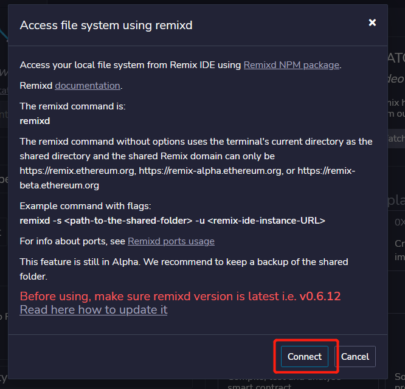
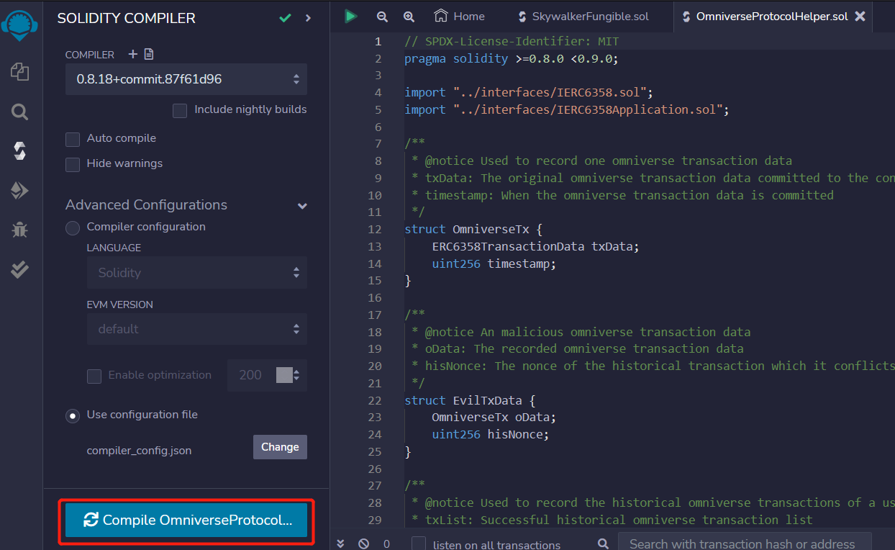
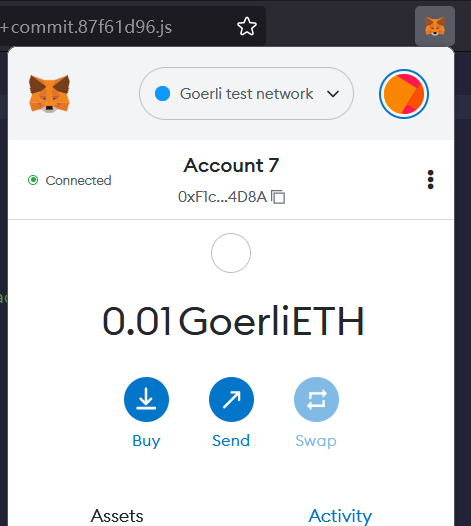
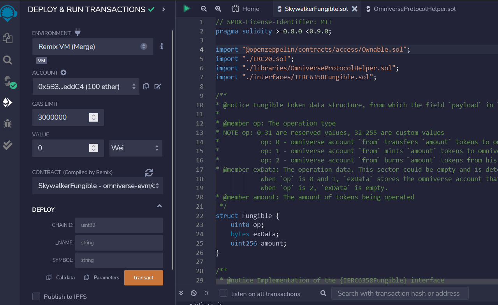
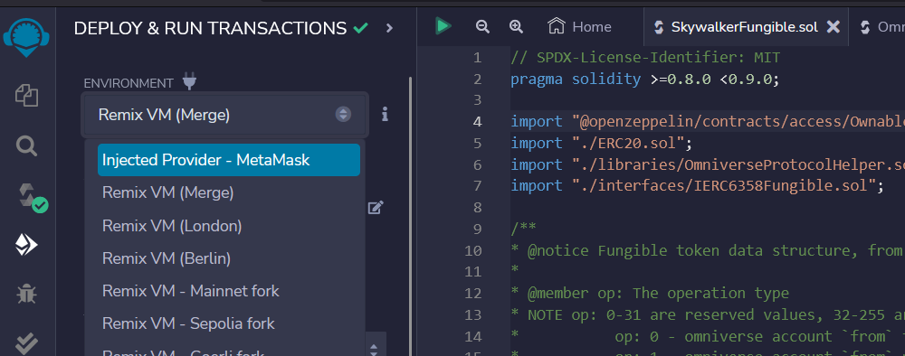
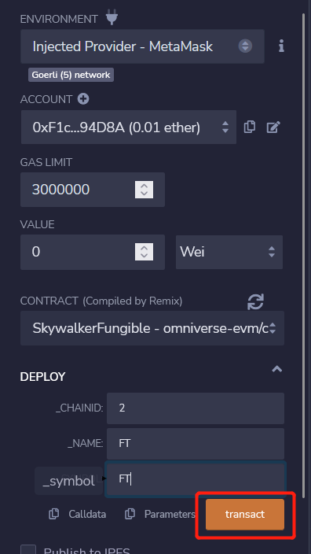
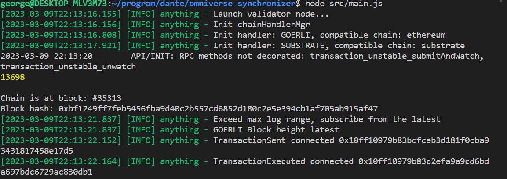
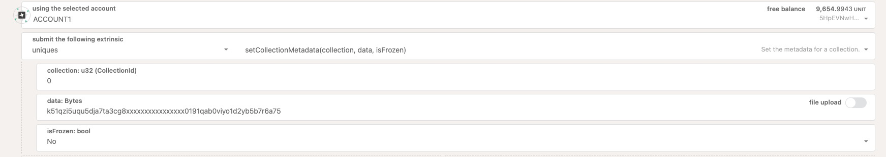
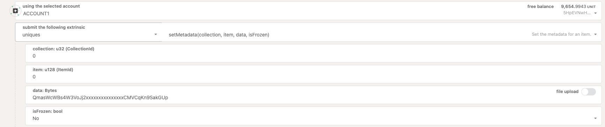

# Tutorial for deploying an Omniverse Token

From this tutorial, you can learn how to deploy an Omniverse FT or NFT, which almost follow the same process. 

In this tutorial, you will use these repos:
- [omniverse-evm](https://github.com/Omniverse-Web3-Labs/omniverse-evm/tree/web3-grant): Contains the contract code for EVM-compatible chains.  
- [omniverse-swap](https://github.com/Omniverse-Web3-Labs/omniverse-swap/tree/web3-grant): Contains the pallets for Substrate.  
- [omniverse-synchronizer](https://github.com/Omniverse-Web3-Labs/omniverse-synchronizer/tree/web3-grant): The synchronizer responsible for synchronizing messages between chains. **The configuration needs to be changed according to the users.**
- [omniverse-transaction-tools](https://github.com/Omniverse-Web3-Labs/omniverse-swap-tools/tree/web3-grant): The tool-chain to operate the omniverse transactions. **The configuration needs to be changed according to the users.**

## Prerequisites
- Truffle >= v5.7.9
- Ganache >= v7.7.5(If you want to run tests for `omniverse-evm`)
- Node >= v18.12.1
- NPM >= 8.19.2
- MetaMask
- Remix
- git
- build-essential
- make
- llvm
- clang
- curl
- libssl-dev
- protobuf-compiler

## Deployment

### Substrate

You can start a local Omniverse-DLT Substrate node.

#### To compile the Omniverse-DLT Substrate node

  1. Open a terminal shell on your computer.
  
  2. Clone the node repository by running the following command:

  ```bash
  git clone -b web3-grant https://github.com/Omniverse-Web3-Labs/omniverse-swap.git
  ```

  3. Change to the root of the node template directory by running the following command:

  ```bash
  cd omniverse-swap
  ```

  4. Compile the node template by running the following command:

  ```bash
  cargo build --release  
  ```

#### Start the local Omniverse-DLT node

After the node is compiled, follow the steps below to run the node:

  1. Open a terminal shell.

  2. Change to the root directory where you compiled the Omniverse-DLT node.

  3. Start the node in development mode by running the following command:

  ```bash
  ./target/release/node-template  --dev
  ```

  4. Verify your node is up and running successfully by reviewing the output displayed in the terminal. The terminal should display output similar to this:

  ```bash
  2023-03-08 23:11:50 Substrate Node
  2023-03-08 23:11:50 ✌️  version 4.0.0-dev-f6dccb957e1
  2023-03-08 23:11:50 ❤️  by Substrate DevHub <https://github.com/substrate-developer-hub>, 2017-2023
  2023-03-08 23:11:50 📋 Chain specification: Development
  2023-03-08 23:11:50 🏷  Node name: jittery-bridge-0008
  2023-03-08 23:11:50 👤 Role: AUTHORITY
  2023-03-08 23:11:50 💾 Database: RocksDb at ./data/chains/dev/db/full
  2023-03-08 23:11:50 ⛓  Native runtime: node-template-100 (node-template-1.tx1.au1)
  2023-03-08 23:11:51 Using default protocol ID "sup" because none is configured in the chain specs
  2023-03-08 23:11:51 🏷  Local node identity is: 12D3KooWDUSyMnSB3Nb3XMe2vqdd89sKWTNx5BWMWi82gCGcy1tA
  ...
  ...
  ...
  ...
  2023-03-08 23:11:56 💤 Idle (0 peers), best: #21499 (0x2b15…a013), finalized #21497 (0xb0aa…0edb), ⬇ 0 ⬆ 0
  ```
  If the number after `finalized` is increasing, your blockchain is producing new blocks and reaching consensus about the state they describe.
  
  5. Keep the terminal that displays the node output open to continue.

Now, you can start exploring what it does using [polkadot-js](https://polkadot.js.org/) or [contract_ui](https://contracts-ui.substrate.io/)

#### Create token

We have provided the [detailed tutorial](./README.md#create-your-own-omniverse-token) of how to create Omniverst tokens on the `O-DLT` parachain. The following is an overview.  

Open `polkadot.js apps` and connect to the node you launched. Navigate to page `Developer->Extrinsics`, Select the module `assets` and method `createToken`.  


- ownerPk: The omniverse address of the owner of the token
- tokenId: The token identity
- members: The members supported by the token, it is optional and can be set later

### EVM-compatible chain

**NOTE: The account which is used to deploy the contract SHOULD have the same private key as the owner of the token created previously**

You can deploy the contracts on any EVM-compatible chain, but let us use Goerli as example. Here I assume you are familiar with Ethereum, at least knowing how to create an account and receiving some tokens from faucet.

#### Clone omniverse-evm
Enter your work directory, let's say `<WORK_DIR>`, input the code
```
git clone -b web3-grant https://github.com/Omniverse-Web3-Labs/omniverse-evm.git
```

#### Launch Remix
- Open the Remix  
  Open the Chrome, navigate to the address `https://remix.ethereum.org`

- Install Remixd  
  Remixd is an NPM module that intends to be used with Remix IDE web and desktop applications. It establishes a two-way websocket connection between the local computer and Remix IDE for a particular project directory.

  ```
  npm install -g @remix-project/remixd
  ```

- Start remixd
  ```
  remixd -s <WORK_DIR>
  ```
  `<WORK_DIR>` is your working directory

- Open workspace  
  Click `-connect to localhost-` on Remix.  
  

  Then click `Connect` in the popup window.  
  

#### Deploy contracts
- Open files  
  Open `SkywalkerFungible.sol` and `libraries/OmniverseProtocolHelper.sol`.
  

- Compile files  
  Compile the files respectively by choosing one file and clicking the `compile` button, or press `ctrl` + `s`.
  

- Deploy `SkywalkerFungible`  
  Choose the network as `Goerli` and switch the account with witch you will deploy the contract.  
  

  Enter the `Deploy` page  
  

  Choose the environment as `Injected Provider - MetaMask` and choose the contract as `SkywalkerFungible`  
  

  You must input the chain id, which indicates on which chain the contract will be deployed, token name and token symbol. Then click the `transact` button, you will be asked to sign two transactions later, the first is for `OmniverseProtocolHelper`, the latter is for `SkywalkerFungible`.  
  

### Synchronizer
#### Clone `omniverse-synchronizer`
```
git clone -b web3-grant https://github.com/Omniverse-Web3-Labs/omniverse-synchronizer.git
```

#### Install
```
cd omniverse-synchronizer
npm install
```

#### Change configuration
- Open the file `config/default.json`
- Set the address of the contract `SkywalkerFungible` deployed above to the field `GOERLI`.`skywalkerFungibleContractAddress`.
- Set the node address of your substrate node to the field `SUBSTRATE`.`nodeAddress`.


#### Set keys for routers
Keys are stored in the file `.secret`.  
```
cp config/.secret.example config/.secret
```

Set the private keys in `.secret` to networks which your token will support.

#### Launch
```
npm src/main.js
```

You can see outputs on the screen like this  


## Initialization
### Substrate
#### Set members
The members determine which chains are supported by the omniverse token.

*This step can be ignored, if the members have been set in `createToken`*

Call the method `setMembers` of the module `assets` using the account which is the owner of the token. The argument include all members of the token.


There are two members of the token:  
- GOERLI: `2` is its chain id, `0x...fa8` is the token contract address.
- SUBSTRATE: `1` is its chain id, `FT` is the token id.

### EVM-compatible chain
#### Set cooling down time
The cooling down time is used to limit the speed of an omniverse transaction, in order that there is enough time to deal with conflicts.

Call the method `setCoolingDownTime` of `SkywalkerFungible` in Remix, with argument `10`, which means the cooling down time is 10s.


#### Set members
Call the method `setMembers` of `SkywalkerFungible` in Remix, with argument `[[2, <EVM-CONTRACT-ADDRESS>], [1, <SUBSTRATE-TOKEN-ID>]]`, which means there are two members, one is the chain with id `2` and contract `<EVM-CONTRACT-ADDRESS>`, the other one is the chain with id `1` and token id `<SUBSTRATE-TOKEN-ID>`.


## Experience

**Keep the synchronizer running when executing Omniverse transactions.**

### Change the IP of the Local Substrate Parachain


### Mint tokens

The [tool](https://github.com/Omniverse-Web3-Labs/omniverse-swap-tools/tree/web3-grant) needs to be used to mint tokens, follow the [README.md](https://github.com/Omniverse-Web3-Labs/omniverse-swap-tools/blob/web3-grant/README.md) to install the tool and set private key of the owner in `.secret`.

Input the following code to mint tokens:
```
node index.js -m FT,0x5a1...,100
```

- `FT`: The id of the token you created.
- `0x5a1...`: The Omniverse account you want to mint tokens to.
- `100`: The count you want to mint.

See the [tutorial](./README.md) for more information about how to use Omniverse tokens. For `Solidity` version, you can also use `Remix` to send Omniverse transactions, but it is recommended to use the [`EVM tool`](https://github.com/Omniverse-Web3-Labs/omniverse-evm/tree/web3-grant/contracts).

## Addition
If you want to deploy an Omniverse NFT, just replace `SkywalkerFungible` with `SkywalkerNonFungible` for EVM-compatible chains, and replace `assets` with `uniques` for Substrate, and do some extra work.

### Substrate
#### Set the metadata for a collection



The `data` is ipfs CID of JSON object, like this:

```json
{
  "name": "My NFT",
  "image": "QmasWcWBs4W3VoJj2xxxxxxxxxxxxxxxCMVCqKn9SakGUp",
  "description": "###"
}
```

After setting the collection metadata, `Network -> NFT -> My NFTs` will display the owned NFTs.

#### Set the metadata for an item



The `data` struct is the same as above.

```json
{
  "name": "My NFT #1",
  "image": "QmXJZpCgRwA4LgzP7xxxxxxxxxxxxxxxQyfYJ8Bn5W9UoF",
  "description": ""
}
```

### EVM-compatible chains
#### Set base URI
The base URI is used to index the metadata of NFT.

Call the method `setBaseURI` of the deployed `SkywalkerNonFungible`.

If the base URI is `<BASE_URI>`, then the URI of an NFT with id `<ID>` is `<BASE_URI><ID>`.
