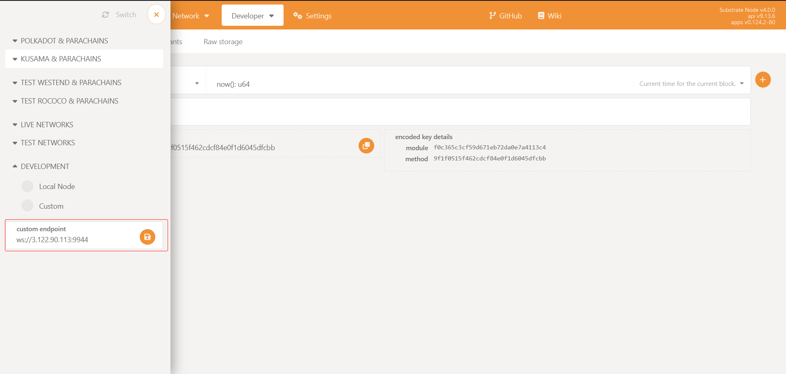
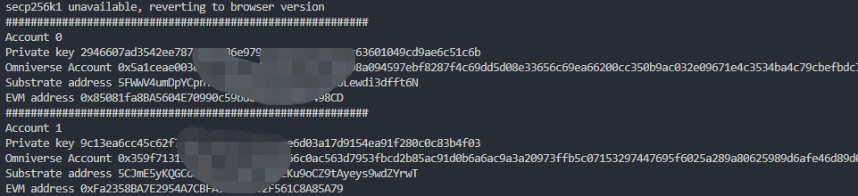
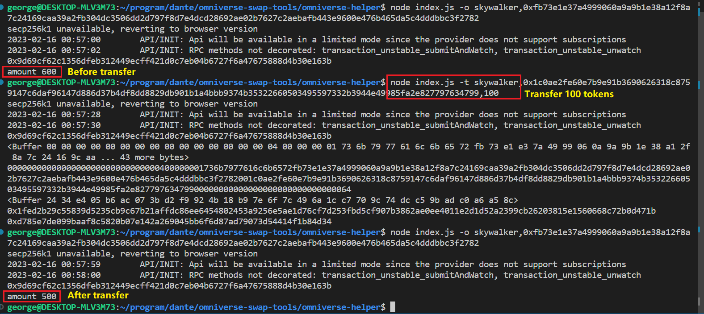
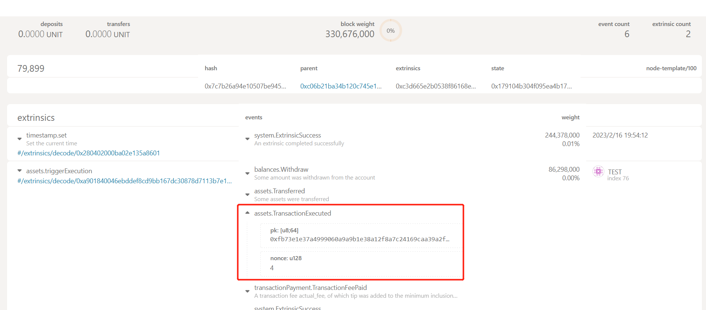
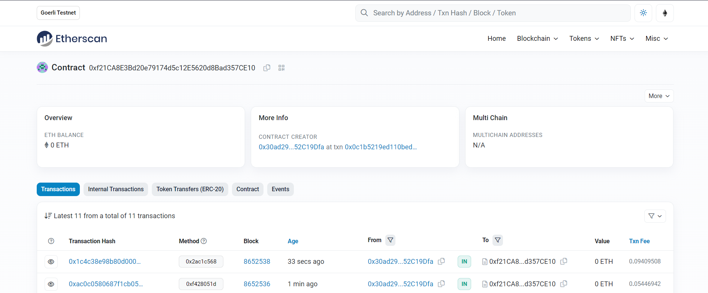
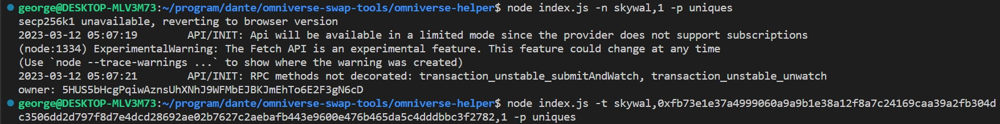
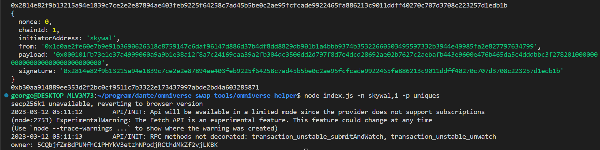
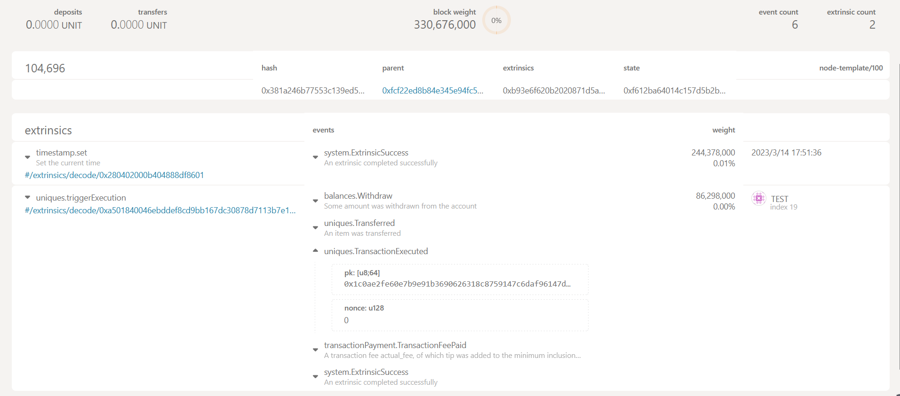
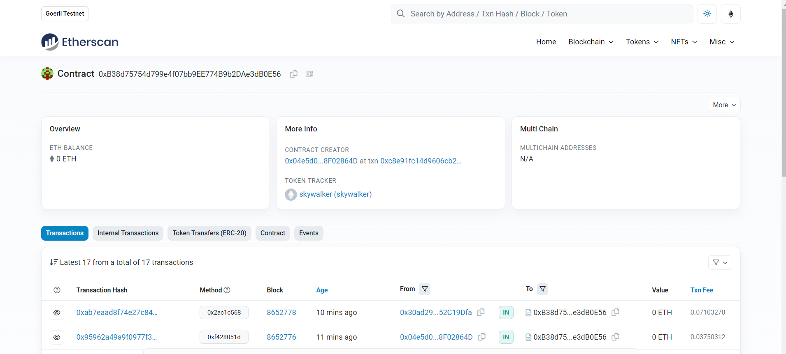

# Tutorial
*This document helps beginners taste the basic functions of `Omniverse DLT` step by step.*  

- The full souce code of the related repo of the tools is [here](https://github.com/Omniverse-Web3-Labs/omniverse-swap-tools/tree/web3-grant).  
- The EVM tools can be found [here](https://github.com/Omniverse-Web3-Labs/omniverse-evm/tree/web3-grant/contracts), and remember to go there to execute EVM related operetions. This will be integrated into a whole tool.  
- In this stage, we have designed and made out an intuitive [prototype](https://github.com/Omniverse-Web3-Labs/o-amm) of the Omniverse AMM algorithm.  
- Besides, we also provide an [on-chain prototype](https://github.com/Omniverse-Web3-Labs/O-AMM-ParaSim) for the `off-chain calculation, and on-chain verification` based on a specific verifiable computation, which can be tested manually through an [operation tutorial](https://github.com/Omniverse-Web3-Labs/O-AMM-ParaSim/tree/main/off-chain-calc).


## Index
* [Prepare Environment](#environment)
* [Install](#tools-install)
* [Omniverse Account](#omniverse-account)
* [Omniverse Token](#omniverse-token-protocol)
* [Advanced Features](#advanced-features)

## Environment
* [Connection](#connection)
* [Deployment](#deployment)
    * [Parachain of Omniverse DLT](#parachain-of-omniverse-dlt)
    * [EVM chains](#evm-chains)
* [Smart contracts on EVM Chains](#evm-chains)
* [Get Gas Token](#get-gas-tokens)

### Connection
The Parachain of `Omniverse DLT` is deployed at `ws://3.122.90.113:9944`, and we recommand using [Polkadot.js](https://polkadot.js.org/apps/#/explorer) to connect to it.  

<p align='center'>Figure.1 Connect to `Omniverse DLT` Parachain</p>  

If succeed, you can find the related pallets at [Chain state](https://polkadot.js.org/apps/#/chainstate):  
  

### Deployment
To make it convenient, we have already deployed one kind of Omniverse Tokens, token $skywalker$ for FT and token $skywal$ for NFT, which have been already initialized on the `Omniverse DLT` Parachain of Polkadot.  

**You can also follow the [Tutorial](./Deployment.md) to deploy your own Omniverse tokens**

<!-- ***Note that the precision of the Omniverse tokens is $10^{0}$.*** -->

#### Parachain of `Omniverse DLT`
* Pallet `Assets` is for fungible token:  
    * The `tokenId` of the deployed token$ is `skywalker`
* Pallet `Uniques` is for non-fungible token:  
    * The `tokenId` of the deployed token is `skywal`
* Pallet `OmniverseProtocol` is mainly used to manage account, verify omniverse transactions

#### EVM chains
The Omniverse tokens are also deployed as smart contracts on EVM-compatible chains.  
- GOERLI:
    - "skywalker"(FT): [0xf21CA8E3Bd20e79174d5c12E5620d8Bad357CE10](https://goerli.etherscan.io/address/0xf21CA8E3Bd20e79174d5c12E5620d8Bad357CE10),
    - "skywal"(NFT): [0xB38d75754d799e4f07bb9EE774B9b2DAe3dB0E56](https://goerli.etherscan.io/address/0xB38d75754d799e4f07bb9EE774B9b2DAe3dB0E56),

## Tools Install
The Omniverse operation tools can be found [here](https://github.com/Omniverse-Web3-Labs/omniverse-swap-tools/tree/web3-grant).  
* Go to the [repo of the tools](https://github.com/Omniverse-Web3-Labs/omniverse-swap-tools).
* Clone the repo, and switch to the branch `web3-grant`. 
* Install the dependent packages.  
    ```sh
    npm install
    ```
* The explanation of the commands.
    ```sh
    node index.js --help
    ```

## Omniverse Account
Omniverse operations are all based on the Omniverse account, which is equivalent to the native address on each chain and is interconvertible. When making an operation on a concrete chain(e.g. `Omniverse DLT` Parachain on Polkadot), we can use the original Polkadot account/address or the Omniverse account. It's transparent for users.  
Currently, we have made a specific tool to operate Omniverse Account.  
* [Create Account](#create-account)
* [Check the Account](#check-the-account)

### Create Account
As we mentioned above, the Omniverse account is equivalent to the native account. We can create an new account through the [Polkadot.js/apps](https://polkadot.js.org/apps/#/accounts)
  
<p align='center'>Figure.2 Create an Omniverse account through Polkadot.js/apps</p>  

***Note that***:  
*For current versions of polkadot apps, you should change an option to enable this function: Settings -> General -> account options -> Allow local in-brower account storage*
1. Choose `Raw seed`
2. Choose `ECDSA (Non BTC/ETH compatible)` in `keypair crypto type`
3. Record the value of the `secret seed`, which will be used in the Omniverse account tool.

#### Get Gas Tokens
Before using the new account created by [Create Account](#create-account) in the `Omniverse Tools` below, you need to get some gas tokens first as shown in *Figure.3*.  
* Use the default account `Alice` of the Parachain to send some gas tokens to your new account directly.
  
<p align='center'>Figure.3 Get some Gas Tokens</p>  


### Check the Account
You can check the information of the account with the `secret seed` mentioned at [previous chapter](#create-account).  
* Create a new file named `.secret` at the same path of [.secret-example](https://github.com/Omniverse-Web3-Labs/omniverse-swap-tools/blob/web3-grant/omniverse-helper/.secret-example), and set the `secret seed` in it, the content of which is something as below:  
    ```json
    {
        "sks": [
            "b4c88b446aa0923be87ca6e02e4c767bd6xxxxxxxxxxxxxxxxxxxxxxxxxx",
            "a4c88b446aa0923be87ca6e02e4c767bd6xxxxxxxxxxxxxxxxxxxxxxxxxx"
        ],
        "index": 0
    }
    ```
    * `sks` are secret keys of the Omniverse Accounts. Normally, we need to create two keys that one is the sender and the other is the receiver, as we will do [Omniverse Transferring](#make-transaction-of-omniverse-token) later.
    * `index` means which account is used to make transactions, which starts from `0` and it is related to the first secret key in `sks`.

* Check the information of your account with the command below:  
    ```sh
    # command to get the account information, including:
    # Omniverse Account
    # account on Polkadot
    # account on EVM chains
    # @ -a, --account
    node index.js -a
    ```
    * You may see something as follows:  
  

## Omniverse Token Protocol
Currently, we support both Omniverse Fungible Token and Omniverse Non-Fungible Token.

### Omniverse Fungible Token
The operations related to the Omniverse Fungible Token include `claim`, `balance of`, and `transfer`.  
* [Claim](#claim)
* [Check the balance](#check-the-balance)
* [Transaction](#make-transaction-of-omniverse-token)
    * [Initiate a transaction](#initiate-the-omiverse-transaction)
    <!-- * [Initiate on EVM chains](#initiate-transaction-on-evm-chains) -->

### Claim
* `Claim` Token $skywalker$ to operation Account:  
    ```sh
    # -c, --claim <tokenId>
    node index.js -c skywalker
    ```

### Check the balance
#### Check balance on Polkadot
* Check `balance of` Token $skywalker$ of related account on Polkadot:  
    ```sh
    # -o, --omniBalance <tokenId>,<omniverse account>
    node index.js -o skywalker,0x256077...
    ```
    * `skywalker` is the tokenId mentioned [above](#parachain-of-omniverse-dlt).  
    * `0x256077...` is the Omniverse Account got by [-a/--account](#check-the-account).  
    * **Note that** there is `,` between the paremeters.  

#### Check balance on EVM chains
* Go to [EVM tools path](https://github.com/Omniverse-Web3-Labs/omniverse-evm/tree/web3-grant/contracts) first, and follow the tutorial to check what happened on EVM. 

* Check `balance of` Token $skywalker$ of related account on EVM chains:  
    ```
    cd contracts
    node register/index.js -ob GOERLI,0x256077...
    ```
    * `GOERLI` is the network name from which we want to query the balance.  
    * `0x256077...` is the Omniverse Account got by [-a/--account](#check-the-account).  
    * **Note that** there is `,` between the paremeters.  

### Make transaction of Omniverse Fungible Token
#### Initiate the Omiverse transaction
* Transfer Token $skywalker$ to another account on Polkadot:
    ```sh
    # --transfer <tokenId>,<pk>,<amount> 
    node index.js -t skywalker,0x256077...,66
    ```
    * `skywalker` is the example tokenId of token $skywalker$.
    * `0x256077...` is the receive Omniverse Account. You can get the Omniverse Account by [get account](#check-the-account).
    * `66` is the amount of transferred token $skywalker$.

* Check `balance of` Token $skywalker$ of sender and receiver account as detailed at [Check the balance](#check-the-balance) above.  
    * Check `balance of` Token $skywalker$ of related account on Polkadot:  
    ```sh
    # sender
    # -o, --omniBalance <tokenId>,<omniverse account>
    node index.js -o skywalker,<o-account of sender>
    # receiver
    # -o, --omniBalance <tokenId>,<omniverse account>
    node index.js -o skywalker,<o-account of receiver>
    ```
    * You may find outputs as follows:  
      
      

    * Go to [EVM tools path](https://github.com/Omniverse-Web3-Labs/omniverse-evm/tree/web3-grant/contracts) first, and follow the tutorial to check what happened on EVM. 
    * Check `balance of` Token $skywalker$ of related account on EVM chains at [Check the balance](#check-the-balance) above:  
    * You can check the transaction on EVM chains at skywalker [0xf21CA8E3Bd20e79174d5c12E5620d8Bad357CE10](https://goerli.etherscan.io/address/0xf21CA8E3Bd20e79174d5c12E5620d8Bad357CE10) as follows:  
    

### Omniverse Non-Fungible Token
The operations related to the Omniverse Non-Fungible Token include `claim`, `balance of`, `owner of` and `transfer`.  
* [Claim](#claim-nft)
* [Check the balance](#check-the-balance-nft)
* [Transaction](#make-transaction-of-omniverse-nft)
    * [Initiate a transaction](#initiate-the-omiverse-nft-transaction)
    <!-- * [Initiate on EVM chains](#initiate-transaction-on-evm-chains) -->

### Claim NFT
* `Claim` Token $skywal$ to operation Account:  
    ```sh
    # -c, --claim <tokenId>
    node index.js -c skywal,<tokenId> -p uniques
    ```
    `<tokenId>` is the id of the Omniverse NFT
    **Before claiming, please make sure the token is not existed by [querying the owner](#check-the-owner-of-nft)**

    A few minutes later, you can scan the NFT on OpenSea, [like this](https://testnets.opensea.io/zh-CN/assets/goerli/0xB38d75754d799e4f07bb9EE774B9b2DAe3dB0E56/3). **This is just for the token id smaller than 100.**

### Check the balance
#### Check balance on Polkadot
* Check `balance of` Token $skywal$ of related account on Polkadot:  
    ```sh
    # -o, --omniBalance <tokenId>,<omniverse account>
    node index.js -o skywal,0x256077... -p uniques
    ```
    * `skywal` is the tokenId mentioned [above](#parachain-of-omniverse-dlt).  
    * `0x256077...` is the Omniverse Account got by [-a/--account](#check-the-account).  
    * **Note that** there is `,` between the paremeters.  

#### Check balance on EVM chains
* Go to [EVM tools path](https://github.com/Omniverse-Web3-Labs/omniverse-evm/tree/web3-grant/contracts) first, and follow the tutorial to check what happened on EVM. 

* Check `balance of` Token $skywal$ of related account on EVM chains:  
    ```
    node register/nft.js -ob GOERLI,0x256077...
    ```
    * `GOERLI` is the network name from which we want to query the balance.  
    * `0x256077...` is the Omniverse Account got by [-a/--account](#check-the-account).  
    * **Note that** there is `,` between the paremeters.  

### Check the owner of NFT
#### Check owner on Polkadot
* Check `owner of` Token $skywal$ of related account on Polkadot:  
    ```sh
    # -o, --omniBalance <tokenId>,<omniverse account>
    node index.js -n skywal,<tokenId> -p uniques
    ```
    * `skywal` is the tokenId mentioned [above](#parachain-of-omniverse-dlt).  
    * `<tokenId>` is the id of the queried Omniverse NFT.  
    * **Note that** there is `,` between the paremeters.  

#### Check owner on EVM chains
* Go to [EVM tools path](https://github.com/Omniverse-Web3-Labs/omniverse-evm/tree/web3-grant/contracts) first, and follow the tutorial to check what happened on EVM. 

* Check `owner of` Token $skywal$ of related account on EVM chains:  
    ```
    node register/nft.js -oo GOERLI,<tokenId>
    ```
    * `GOERLI` is the network name from which we want to query the balance.  
    * `<tokenId>` is the id of the Omniverse NFT to be queried.  
    * **Note that** there is `,` between the paremeters.  

### Make transaction of Omniverse Non-Fungible Token
#### Initiate the Omiverse transaction
* Transfer Token $skywal$ to another account on Polkadot:
    ```sh
    # --transfer <tokenId>,<pk>,<amount> 
    node index.js -t skywal,0x256077...,66 -p uniques
    ```
    * `skywal` is the example tokenId of token $skywal$.
    * `0x256077...` is the recipient Omniverse Account. You can get the Omniverse Account by [get account](#check-the-account).
    * `66` is the token id of transferred token $skywal$.

* Check `owner of` Token $skywal$ as detailed at [Check the NFT balance](#check-the-balance-nft) above.  
    * Check `owner of` Token $skywal$ of related account on Polkadot:  
    ```sh
    # sender
    # -o, --omniBalance <tokenId>,<omniverse account>
    node index.js -o skywal,<o-account of sender> -p uniques
    # receiver
    # -o, --omniBalance <tokenId>,<omniverse account>
    node index.js -o skywal,<o-account of receiver> -p uniques
    ```
    * You may find outputs as follows:  
      
      
      

    * Go to [EVM tools path](https://github.com/Omniverse-Web3-Labs/omniverse-evm/tree/web3-grant/contracts) first, and follow the tutorial to check what happened on EVM. 
    * Check `balance of` Token $skywal$ of related account on EVM chains at [Check the balance](#check-the-balance) above:  
    * You can check the transaction on EVM chains at skywal [0xB38d75754d799e4f07bb9EE774B9b2DAe3dB0E56](https://goerli.etherscan.io/address/0xB38d75754d799e4f07bb9EE774B9b2DAe3dB0E56) as follows:  
    

## Advanced Features
We also provided an advanced feature:
- [create your own Omniverse Token](#create-your-own-omniverse-token)

*Note that these tools are only available on Polkadot as the limitation of time. They will be easily extended to other chains and we will finish them soon.*

### Create your own Omniverse Token

You can refer to this [deployment tutorial](./Deployment.md) to create Omniverse tokens.