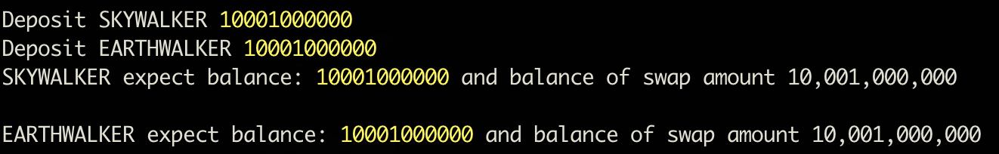
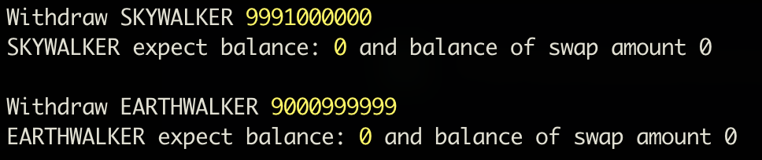

# Test Guide for Milestone 2 from the W3F Grants

This document will show you how to test O-DLT.

The [system test tool](https://github.com/Omniverse-Web3-Labs/omniverse-system-test/tree/milestone-2) is used to make the e2e test for the O-DLT.

## Prerequisites

- node >= v18
- npm >= 8.19
- git
- docker and docker-compose

## Installation

### Clone the repository

```sh
git clone -b milestone-2 --recursive https://github.com/Omniverse-Web3-Labs/omniverse-system-test.git
```

### Install

Enter the working directory, and execute the following commands

```sh
npm install
```

### Install for related projects

```sh
node src/index.js -i
```

## Run test

### Test of fungible tokens

#### Automatical test of fungible tokens

Only one command is needed to execute the test, the output of which will show you what the test is doing. The output will be explained in detail in [Explaination of fungible tokens test](#explaination-of-fungible-tokens-test)

```sh
node src/index.js -t ft
```

#### Explaination of fungible tokens test

There are several steps in the full test flow, which is executed absolutely automatical and you may see the following configures and outputs.  

- 1 Initialize network config for the test, currently EVM, INK and SUBSTRATE.

    

- 2 Run local nodes (Parachains and EVM chains) for all networks that initialized by step 1.

    

    after run local nodes, it will show all nodes information:

    

- 3 Deploy the omniverse token on all supported networks

    

    after deploy the omniverse token, it will show all deployed contract information:

    

- 4 Initiliaze synchronizer

    

- 5 Prepare for testing

    

- 6 Test

  Mint and transfer tokens omniversely, and the transactions will be synchronized among the three chains by the synchronizer, more over, the transactions will be verified **simutanously and independently**. The verifications are just based on **crypto signature**, which makes it absolutely trustless.  

  - 6.1 CHAIN1(EVM) executes the mint transaction with `100` token to `user1` on .

    

  - 6.2 CHAIN1(EVM) executes the transfer transaction with `11` token to `user2`.

    

  - 6.3 the token balance of `user2` on CHAIN1(EVM) is `11`.

    

  - 6.4 CHAIN2(SUBSTRATE) executes the mint transaction with `100` token to `user1`.

    

  - 6.5 CHAIN2(SUBSTRATE) executes the transfer transaction with `11` token to `user2`.

    

  - 6.6 the token balance of `user2` on CHAIN2(SUBSTRATE) is `22`.

    

  - 6.7 CHAIN3(INK) executes the mint transaction with `100` token to `user1`.

    

  - 6.8 CHAIN3(INK) executes the transfer transaction with `11` token to `user2` on CHAIN3(INK).

    

  - 6.9 the token balance of `user2` on CHAIN3(INK) is `33`.
  
    

The test will be over in about 5 minutes, and `Test competed and successfull` will be printed in the terminal if successful.

### Test of swap

#### Automatical test of swap

Only one command is needed to execute the test, the output of which will show you what the test is doing. The output will be explained in detail in [Explaination of swap test](#explaination-of-swap-test)

```sh
node src/index.js -t swap
```

#### Explaination of swap test

There are several steps in the full test flow

- 1 Initialize network config for the test, currently EVM, INK and SUBSTRATE.

    

- 2 Run local nodes for all networks that initialized by step 1.

    

    after run local nodes, it will show all nodes information:

    

- 3 Deploy two omniverse token on all supported networks

    

    after deploy two omniverse token, it will show all deployed contract information:

    

- 4 Initiliaze synchronizer

    

- 6 Prepare for testing

    

- 6 Test

  - 6.1 Mint `10001000000` token of `SKYWALKER` and `SKYWALKER1` to `user1` on CHAIN2(SUBSTRATE).
  
    

    

  - 6.2 Deposit `10001000000` token of `SKYWALKER` and `SKYWALKER1` into swap.

    

  - 6.3 Create/add liquidity for `SKYWALKER` and `SKYWALKER1`.

    

  - 6.4 Swap `100 SKYWALKER` to get `9999 SKYWALKER1`.

    

  - 6.5 Swap `10000 SKYWALKER1` to get `100 SKYWALKER1`.

    

  - 6.6 Withdraw all `SKYWALKER` from swap.

    

The test will be over in about 8 minutes, and `Test competed and success` will be printed in the terminal if successful.

## Additional

**Note that this is not recommended, and instead, close the test by `^C` and follow [auto-deployment](../Auto-Deployment.md) to deploy your own `O-DLT` tokens in an new environment.**  

If the test is executed successfully, the program will not be terminated until `^C` is inputed, we can use tools for different networks to interact with the O-DLT.  

The tools are

- EVM

```sh
cd submodules/omniverse-evm/contracts
node register/index.js -h // For help
```

- INK

```sh
cd submodules/omniverse-swap-tools/tool-for-ink
node index.js -h // For help
```

- SUBSTRATE

```sh
cd submodules/omniverse-swap-tools/omniverse-helper
node index.js -h // For help
```
